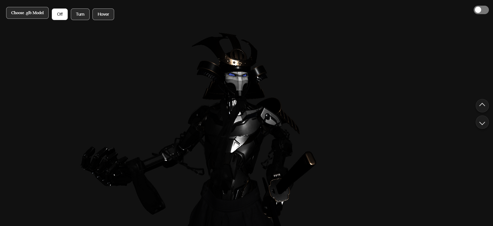
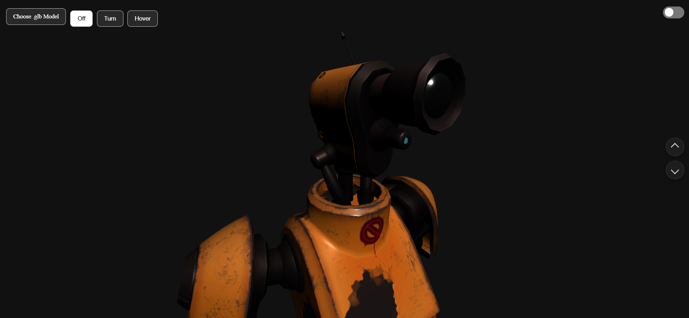

# 3D Avatar Viewer

This is a simple web-based viewer for 3D avatars using the Three.js library.  
You can upload your own `.glb` models, explore them in 3D space, switch between animation modes, and toggle between light and dark backgrounds.

## Features

• Upload and preview `.glb` models directly in the browser  
• Choose between different animation modes: Off, Turn, and Hover  
• Toggle between dark and light themes  
• Move the model up and down using camera buttons  
• Drag with the mouse to rotate the model  
• Responsive interface that works well on desktop and mobile

## Technologies Used

- Three.js  
- GLTFLoader for loading models  
- HTML, CSS, JavaScript (no frameworks)

## Screenshots

Below are example screenshots from the interface:

  

## Live Version

If you want to try it online, you can view the site here:  
https://3d-avatar-three-js.vercel.app/

